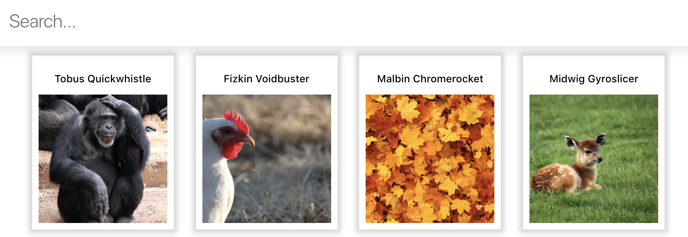

# Brastlewark

Our heroes just arrived at a Gnome town called Brastlewark. To facilitate trade with the local population we grant an easy way to browse all the inhabitants details.

Easily search the gnome you are looking for, and check its details.

## Screenshot

<div>
  
</div>

## Installation

1. Clone this repo

   ```bash
     https://github.com/rusomarques/brastlewark.git
     cd brastlewark
   ```

2. Install dependencies & and start searching for gnomes:

   ```bash
   npm install
   npm start
   ```

### Tech Stack

- React / Redux
- Jest and Enzyme

#### API

- https://raw.githubusercontent.com/rrafols/mobile_test/master/data.json
